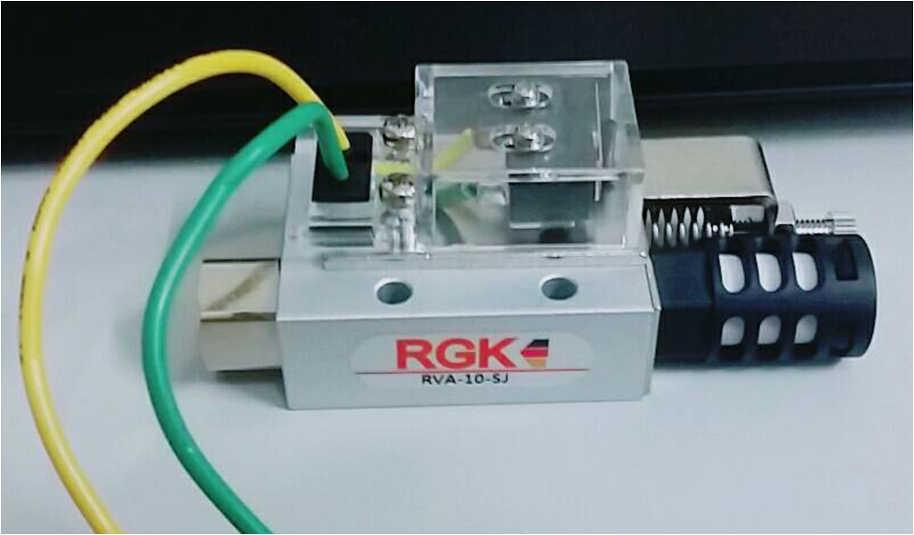
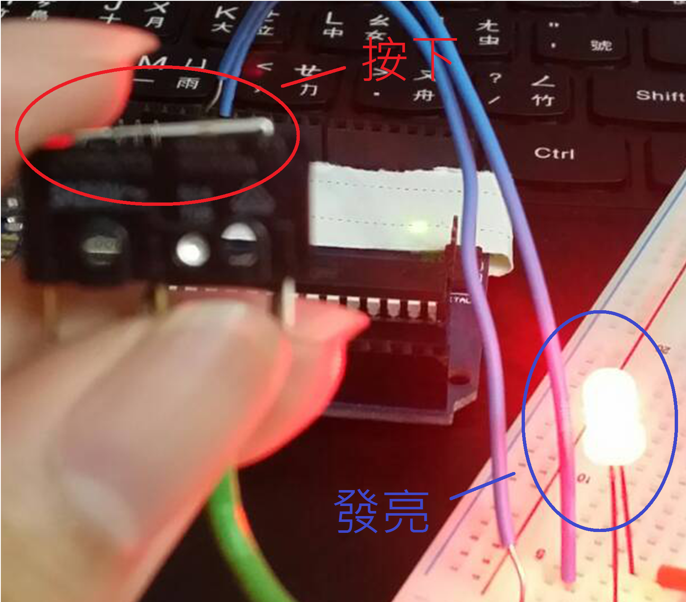
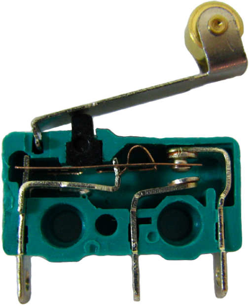

Title: 真空產生器-微動開關
Date: 2017-09-22 19:40
Category: Gripper
Tags: vacuumGenerator, microSwitch
Slug: vacuumGenerator-microSwitch
Author: 40423222

了解真空產生器上的微動開關

<!-- PELICAN_END_SUMMARY -->
<!-- 主要介紹微動開關 -->

## 名稱: RVA-10-SJ

## 1.真空產生器功用:
<h4>真空產生器的觸動桿子(如下圖.a-1)會觸動微動開關(如下圖.a-2)</h4>
 
<h4 align="center">圖.a-1</h4>

 
<h4 align="center">圖.a-2</h4>

<h4>目前還不知道如何推動軸,只能確定軸會推動桿子,因而啟動微動開關. 
下方介紹微動開關說明</h4>

## 2.微動開關說明:
<h4>沒按下彈簧片,會形成斷路,所以LED不會通電發亮 (如下圖.b-1)</h4>
 
<h4 align="center">圖.b-1</h4>

<h4>按下彈簧片,會形成通路,所以LED會通電發亮(如下圖.b-2)</h4>
 
<h4 align="center">圖.b-2</h4>

<h4>內部構造(如下圖.b-3)</h4>
 
<h4 align="center">圖.b-3</h4>

<h4>微動開關就像按鈕一樣,按下時電流會流通,放開時會形成斷路 
下方為結論</h4>

## 3.結論:
<h4>所以當氣壓驅動真空產生器就會啟動彈簧片(為個人猜測),這時線路(黃線和綠線)就會接通電流</h4>

## 4.注意:
<h4>因為微動開關電線太粗(Arduino孔會損壞),所以要使用接線器,再轉到Arduino上</h4>

## Music:
<iframe width="700" height="50" src="./../data/123.mp3" frameborder="0" allowfullscreen></iframe>